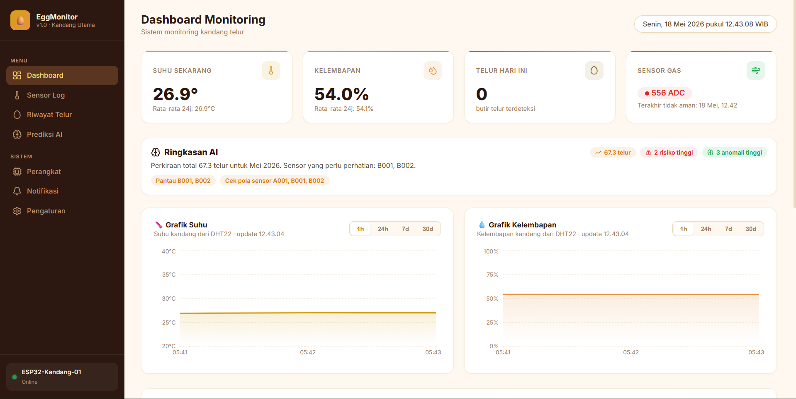
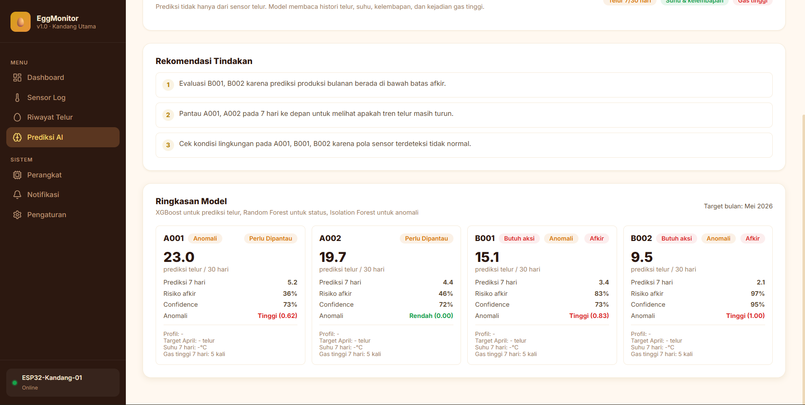
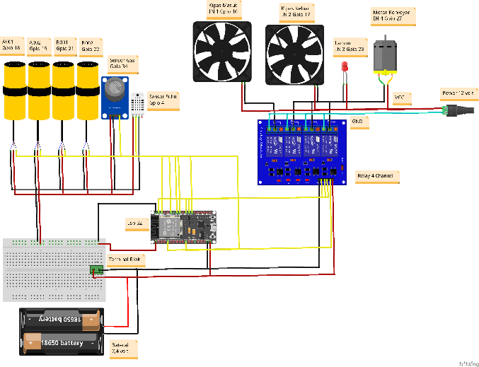

### Egg Monitoring

An end to end IoT setup for a poultry farm. An ESP32 reads temperature, humidity and gas sensors and pushes the data to a Next.js dashboard, which shows live charts, logs egg production per sensor, lets you control actuators (fan, lamp, conveyor) remotely, and runs an AI layer that predicts freshness and flags anomalies. Built for an IoT course.

Was live at `egg.nashiru.me` during the semester.




#### What's inside

- `web/`: the Next.js dashboard and API (Prisma + SQLite). Real time charts, egg logs, actuator control, AI prediction page.
- `firmware/`: ESP32 firmware (PlatformIO) that reads the sensors and posts the data.
- `ml/`: the AI pipeline notebook plus a small data export.

#### How it works

```
ESP32 + sensors  -->  HTTPS  -->  Next.js API  -->  SQLite (Prisma)  -->  dashboard
                                       |
                                       +-->  AI predictions (freshness / anomaly)
```

The device posts readings over HTTPS, the API stores them, and the dashboard reads them back for the charts and the AI summary.

#### Hardware

ESP32, an MQ gas sensor, a DHT temperature/humidity sensor, a 4 channel relay driving two fans, a conveyor motor and a lamp, powered from an 18650 pack.



#### Run the dashboard

```bash
cd web
npm install
npx prisma generate
npm run dev
```

It ships with `web/prisma/dev.db`, which already holds real captured data (around 4,300 sensor readings and 162 egg events), so the dashboard and the notebook work without a live device.

#### Related

The MQTT vs HTTP study that informed the transport choice lives in its own repo: [http-mqtt](https://github.com/nashirulwan/http-mqtt).

#### License

MIT, see LICENSE.
